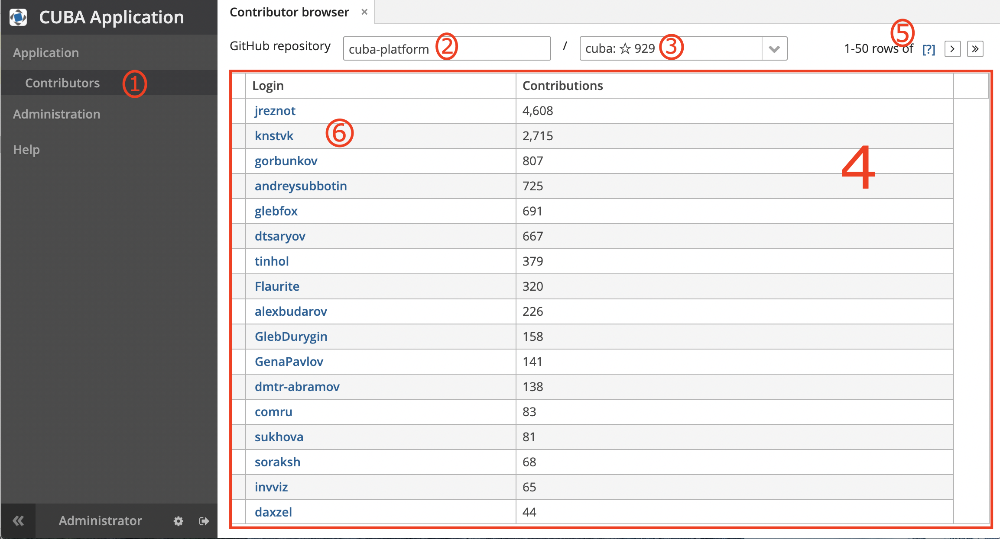

# github-statistics
The sample shows the use of external objects provided via REST API in a CUBA Application.

## Implementation
The project fetches information about repositories, contributors and their details from GitHub using their [public API](https://developer.github.com/v3/). 

- _After opening the Contributors screen (1), a user inputs organization (2)._ 
- _Since organization is specified, the system gets all public repositories of the selected organization 
and provide them as a drop-down list (3), sorted from most to less popular.
The most starred repository is selected by default._ 

    **Implementation:** Retrofit call is implemented in `GithubRestClient#repos`. 
    This request is called from `GithubInfoServiceBean#getRepos`, witch is triggered by
    the `reposDl` data loader delegate `ContributorBrowse#reposDlLoadDelegate`. 
    The `reposDl.load()` happens each time the organization field (2) changes its value, see 
    `ContributorBrowse#onRepoOwnerFieldValueChange`. The repos drop-down field (3) gets filled 
    automatically as it specifies `reposDc` as its options container.    

- _The main table (4) loads all contributors for the selected repository (3). 
If there are more than 50 records, the table shows only one page, which can be changed in 
the table pagination controls (5)._ 

    **Implementation:** Retrofit call is implemented in `GithubRestClient#contributors`. 
    This request is called from `GithubInfoServiceBean#getContributors`, witch is triggered by
    the `contributorsDl` data loader delegate `ContributorBrowse#contributorsDlLoadDelegate`. 
    The `contributorsDl.load()` happens each time the repository field (3) changes its value, see 
    `ContributorBrowse#onRepoNameFieldValueChange`. The table (4) gets filled 
    automatically, because it uses `contributorsDc` as its data container. 
    
    Pagination (5) controls 
    become visible because the `contributorsDl` loader has the `maxResults` attribute specified: 
    `<loader id="contributorsDl" maxResults="50"/>` in the contributors browse screen. 
    Its loader delegate calculates the page to be loaded and calls `GithubInfoServiceBean#getContributors`
    sending requested page number and page size as parameters.  

- _The login links (6) click opens a window with contributor's details, including their avatar image._

    **Implementation:** Retrofit call is implemented in `GithubRestClient#userDetails`, which returns 
    a single `UserInfo` instance. The retrofit call is wrapped into `GithubInfoServiceBean#getUserInfo`. 
    This service is used in the `userInfoDl` data loader delegate, see `UserInfoView#userInfoDlLoadDelegate`.
    
    The `contributorsTable` table (of the contributor browse screen) has a column generator for the `login` column, 
    see `ContributorBrowse#contributorsTableLoginColumnGenerator`. The generator returns a link button that opens
    the `UserInfoView` screen when clicking.
    
    
    
    
